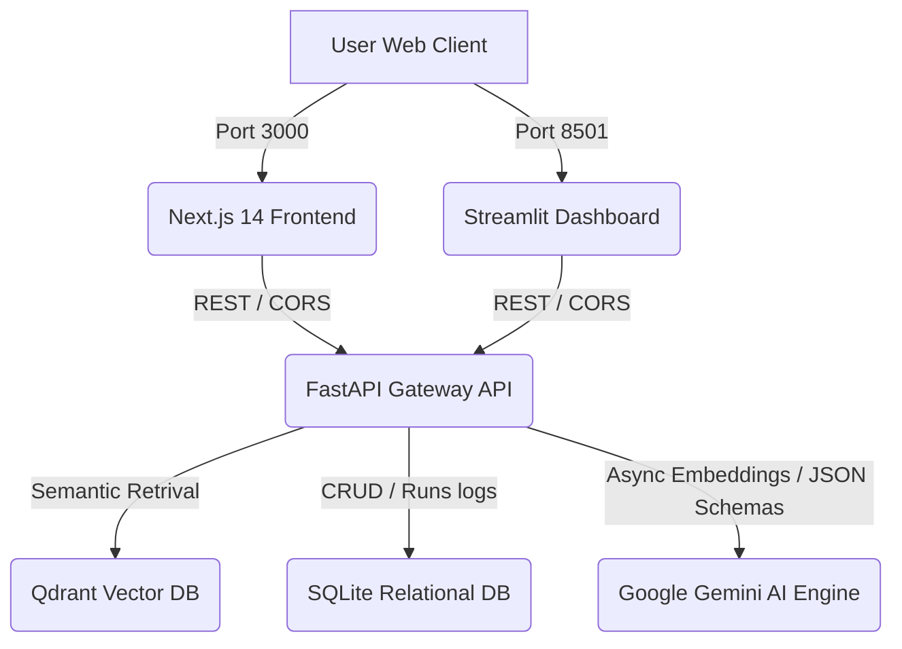

# ReguDrift AI: Enterprise-Scale Regulatory Drift Auditing Platform

ReguDrift AI is an institutional-grade, asynchronous compliance auditing platform. It is engineered to ingest complex internal organizational policy documents, index their logical clauses semantically, and perform high-fidelity, agent-in-the-loop audits against incoming regulatory directives and bulletins (such as SEBI, SEC, GDPR, or SOC2). 

The system automates the detection of compliance gaps, calculates drift indices, maps severities, and delivers interactive technical remediation blueprints (as Infrastructure-as-Code or application-level patch scripts) along with boardroom-ready compliance dossiers.

---

## 🚀 Key Features

*   **Multi-Tier Service Orchestration:** Fully containerized 4-tier microservices cluster bridging Next.js 14, Streamlit, FastAPI, and Qdrant in an isolated network.
*   **Asynchronous Policy Chunker & Ingestion:** Async parser that processes PDF/TXT documents, segments them into logical hierarchies (Chapters, Sections, Clauses), hashes each clause deterministically (SHA-256) to prevent deduplication issues, and generates 3072-dimensional vector embeddings.
*   **Agentic Planner-Executor Audit Loop:** An LLM-powered state machine (`PlanCreation` -> `ContextRetrieval` -> `GapAnalysis` -> `FinalReport`) that reasons about compliance alignment, maps specific deviations, and outlines remediation paths.
*   **Dual Frontend Consoles:**
    *   **Next.js 14 Web Portal:** High-density, premium dashboard mapping visual design tokens, containing a live gateway health checking system, a split-pane *Drift Inspector*, and a boardroom print compilation engine.
    *   **Streamlit Operations Center:** Operational control room supporting direct policy indexing, real-time audit consoles, interactive severity maps, and custom PDF report downloads.
*   **Corporate FPDF2 PDF Generator:** Formats audit findings into professional executive reports featuring custom-branded navy headers, slate-divided tables, risk-colored status badges, and monospace code blocks.
*   **Gemini Schema Sanitizer:** Elegant backend schema inlining and cleaning that circumvents GenAI API limitations regarding nested `$defs`, `$ref`, and `"title"` annotations.

---

## 🏗️ System Architecture



### Port Allocations
*   **Next.js 14 Web Frontend:** `http://localhost:3000`
*   **Streamlit Operations Dashboard:** `http://localhost:8501`
*   **FastAPI API Gateway:** `http://localhost:8000`
*   **Qdrant Vector Database:** `http://localhost:6333` (Web Dashboard: `http://localhost:6333/dashboard`)

---

## 📂 Project Structure

```
d:\Problem Project\
├── DESIGN.md                   # Visual system design tokens source of truth
├── requirements.txt            # Pinned backend dependencies
├── Dockerfile                  # Multi-stage secure FastAPI container build
├── docker-compose.yml          # 4-tier microservices orchestration manifest
├── .dockerignore               # Docker build exclusions
├── .gitignore                  # Git VCS exclusions
├── main.py                     # Root FastAPI Gateway application entrypoint
├── regudrift/
│   ├── config/
│   │   └── settings.py         # Pydantic Settings & environment variables
│   └── core/
│       ├── agent/
│       │   ├── schemas.py      # Structured Output Pydantic schemas
│       │   └── orchestrator.py # Planner-Executor agentic state machine
│       ├── database/
│       │   ├── session.py      # Async SQLAlchemy SQLite database engine
│       │   ├── models.py       # Declarative ORM models (Runs, Gaps, Documents)
│       │   └── service.py      # Async database transactions manager
│       ├── ingestion/
│       │   └── parser.py       # Async PDF/TXT document parser and sliding chunker
│       ├── retrieval/
│       │   └── embedder.py     # Batch embedder using google-genai SDK
│       └── vector/
│           ├── base.py         # Vector database abstraction definition
│           └── qdrant_service.py # Async production Qdrant integration
├── ui/
│   ├── app.py                  # Streamlit SaaS command dashboard
│   ├── reporter.py             # FPDF2 corporate PDF report builder
│   └── Dockerfile              # Lightweight Streamlit container build
└── frontend/
    ├── package.json            # Next.js configurations & scripts
    ├── tailwind.config.ts      # Tailwind parameters mapping Stitch colors
    ├── Dockerfile              # Multi-stage Node.js alpine build configuration
    └── src/
        ├── app/
        │   ├── layout.tsx      # App wrapper with custom fonts (Hanken Grotesk, Inter)
        │   └── page.tsx        # CISO dashboard and split-screen Drift Inspector
        ├── components/
        │   ├── Sidebar.tsx     # Vertical navigation featuring dynamic API health polling
        │   ├── MetricCards.tsx # SVG gauge components for KPI rendering
        │   └── Remediation.tsx # Tabbed monospace code console (Terraform/Python)
        └── lib/
            └── api.ts          # Axios network client bridge
```

---

## 🛠️ Getting Started

### Prerequisites
*   [Docker Desktop](https://www.docker.com/products/docker-desktop/) (running daemon)
*   [Git](https://git-scm.com/)
*   A Gemini API Key (obtain from [Google AI Studio](https://aistudio.google.com/))

### 1. Clone & Configure Environment
Create a `.env` file in the project's root folder:
```env
GEMINI_API_KEY=your_actual_gemini_api_key_here
```

### 2. Build & Launch the Containers
To pull images, compile the Next.js production build, and start the services in detatched mode, run:
```bash
docker compose up --build -d
```

### 3. Verify Container Health
Check if the services are up and healthy:
```bash
docker compose ps
```
All four containers (`regudrift-frontend`, `regudrift-ui`, `regudrift-web`, and `regudrift-qdrant`) should show as `healthy` or `running`.

---

## 🧑‍💻 API Gateway Endpoint Reference

### 1. Ingest Internal Policy
*   **Endpoint:** `POST /api/v1/compliance/ingest`
*   **Content-Type:** `multipart/form-data`
*   **Fields:**
    *   `policy_id` (string): Unique identifier for the policy (e.g., `telemetry_v3`).
    *   `file` (file): Uploaded PDF or TXT file.
*   **Description:** Parses the uploaded policy into semantic chunks, generates vector embeddings, indexes them into Qdrant, and creates a relational entry in SQLite.

### 2. Execute Gap Audit
*   **Endpoint:** `POST /api/v1/compliance/analyze`
*   **Content-Type:** `application/json`
*   **Payload:**
    ```json
    {
      "policy_id": "telemetry_v3",
      "regulatory_text": "Paste regulatory directive text here..."
    }
    ```
*   **Description:** Triggers the Planner-Executor agentic state machine. Performs semantic lookup, conducts comparative alignment analysis, writes the audit output to SQLite, and returns a detailed compliance gap report.

### 3. Health Diagnostics
*   **Endpoint:** `GET /health`
*   **Description:** Performs automated connection checks against SQLite and Qdrant. Returns `{ "status": "ok" }` if all internal adapters are healthy.

---

## 🎨 UI/UX Design System Specifications

The application uses design tokens configured directly from the high-fidelity **Stitch** specification to maintain visual consistency:
*   **Canvas Background:** Midnight Navy (`#0B0F19`)
*   **Elevated Surfaces:** Surface Dim Slate (`#131314` / `#201f20`)
*   **Dividers & Borders:** Outlines (`#46464c`)
*   **Alert Semantics:** Compliant (`#10B981`), Partial (`#F59E0B`), Non-Compliant (`#EF4444`)
*   **Typography Hierarchy:**
    *   *Display / Headlines:* Hanken Grotesk
    *   *Body Copy:* Inter
    *   *Code & Technical Labels:* JetBrains Mono

---

## 🔧 Resolving Gemini Schema Validation Conflicts

When leveraging structured outputs, Pydantic's automatic nested serialization includes `$defs`, `$ref`, and `"title"` keys in its generated JSON schema. The Google GenAI Python SDK (`types.Schema`) fails when encountering these keys, throwing schema validation exceptions.

ReguDrift AI solves this by introducing recursive schema preprocessing in the orchestrator before sending payloads to the model:
1.  **Reference Inlining:** Resolves all `$ref` links and inlines nested definitions using `inline_refs()`.
2.  **Key Sanitization:** Recursively traverses the schema dictionary to prune all `"title"` keys using `clean_schema_for_gemini()`.
This outputs a completely flat, valid JSON schema structure matching the exact constraints of the Gemini engine.
