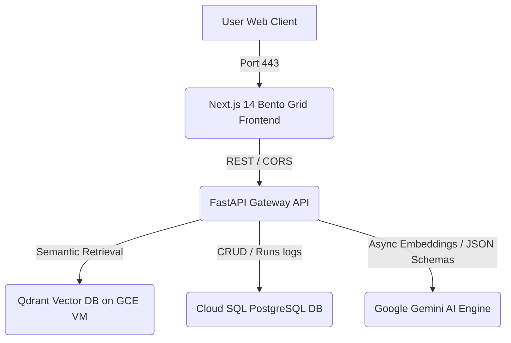

# ReguDrift AI: Enterprise-Scale Regulatory Drift Auditing Platform

ReguDrift AI is an institutional-grade, asynchronous compliance auditing platform. It is engineered to ingest complex internal organizational policy documents, index their logical clauses semantically, and perform high-fidelity, agent-in-the-loop audits against incoming regulatory directives and bulletins (such as SEBI, SEC, GDPR, or SOC2). 

The system automates the detection of compliance gaps, calculates drift indices, maps severities, and delivers interactive technical remediation blueprints (as Infrastructure-as-Code or application-level patch scripts) along with boardroom-ready compliance dossiers.

---

## 🚀 Key Features

*   **Multi-Tier Service Orchestration:** Fully containerized microservices architecture.
*   **Asynchronous Policy Chunker & Ingestion:** Async parser that processes PDF/TXT documents, segments them into logical hierarchies (Chapters, Sections, Clauses), hashes each clause deterministically (SHA-256) to prevent deduplication, and generates 3072-dimensional vector embeddings.
*   **Agentic Planner-Executor Audit Loop:** An LLM-powered state machine (`PlanCreation` -> `ContextRetrieval` -> `GapAnalysis` -> `FinalReport`) that reasons about compliance alignment, maps specific deviations, and outlines remediation paths.
*   **Git CI/CD Integration ("The Commit Blamer"):** Attaches Git commit tracking metadata (`commit_hash`, `author_name`, `commit_timestamp`, `branch_name`) directly to compliance runs and specific drift remediation blocks, providing instant traceability for infrastructure-as-code audits.
*   **Historical Trend Analytics Service:** Aggregates compliance run histories chronologically by date. Dynamically calculates a `global_health_score` (100% baseline, deducting 15% per `CRITICAL`, 10% per `HIGH`, 5% per `MEDIUM`, and 2% per `LOW` severity drift) and tracks `total_critical_drifts`.
*   **Role-Based Access Control (RBAC) System:** Enforces endpoint access verification using HTTP headers (`X-User-Role`) or query params (`role`):
    *   `Auditor`: Read-only access to health endpoints and the historical compliance analytics feed.
    *   `SecOps_Admin`: Full write access allowing policy ingestion, audits, database resets, and connection updates.
*   **Immersive Bento HUD Dark Mode:** A modern, high-density Bento Grid dashboard in deep space dark mode featuring:
    *   *Floating Glass Header:* Hosts navigation tabs, live health connections, and the RBAC role switcher.
    *   *Sonar Radar Scanner:* Dynamic rotating circular SVG scanning animation showing active audit progress.
    *   *Interactive Git Graph:* Clickable vertical SVG commit graph that dynamically blame-traces commits and updates dashboard compliance metrics.
    *   *Comparative Diff Inspector:* Side-by-side color-coded policy alignments highlighting exact drift lines and Git metadata context tags.
    *   *Cloud Shell Terminal:* Monospace console replica (Terraform/Python) supporting boardroom PDF downloads.

---

## 🌐 Google Cloud Platform (GCP) Staging Deployment

ReguDrift AI is deployed in a fully production-hardened network environment on Google Cloud:

### Active Deployment Endpoints
*   **Production Frontend Console (Next.js):** [https://regudrift-console-567903226702.asia-south1.run.app](https://regudrift-console-567903226702.asia-south1.run.app)
*   **Production REST API Gateway (FastAPI):** [https://regudrift-web-567903226702.asia-south1.run.app](https://regudrift-web-567903226702.asia-south1.run.app)

### Infrastructure Specifications
*   **Compute Instance (Qdrant DB):** An `e2-medium` Container-Optimized OS VM running in private subnet `10.0.1.0/24`, with a 30GB Persistent SSD storage mount.
*   **Cloud SQL (PostgreSQL):** PostgreSQL 15 `db-f1-micro` database instance with private-IP VPC Peering.
*   **Serverless VPC Access:** Serverless Connector `regu-vpc-conn` (`10.8.0.0/28`) routes Cloud Run traffic privately into the VPC.
*   **Cloud NAT Gateway:** Connects the private VM subnet to `regudrift-router` and `regudrift-nat` to allow outbound Docker Hub pulls securely.
*   **Secrets Store:** `GEMINI_API_KEY` is securely injected into FastAPI containers directly from **Secret Manager** at runtime.

### Deployment Automation (CI/CD)
To trigger automated rolling updates to Google Cloud Run, push commits directly to the GitHub main branch. Google Cloud Build (`cloudbuild.yaml`) automatically runs:
1.  Compiles backend and frontend docker containers.
2.  Pushes compiled images to Artifact Registry.
3.  Executes rolling updates (`gcloud run deploy`) for both target services.

---

## 🏗️ System Architecture



---

## 📂 Project Structure

```
d:\Problem Project\
├── DESIGN.md                   # Visual system design tokens source of truth
├── requirements.txt            # Pinned backend dependencies
├── Dockerfile                  # Multi-stage secure FastAPI container build
├── cloudbuild.yaml             # Google Cloud Build CI/CD script
├── terraform/                  # Terraform provision scripts (optional reference)
│   ├── provider.tf
│   ├── variables.tf
│   ├── vpc.tf
│   ├── database.tf
│   ├── qdrant_vm.tf
│   └── cloud_run.tf
├── regudrift/
│   ├── config/
│   │   └── settings.py         # Pydantic Settings & environment variables
│   └── core/
│       ├── agent/
│       │   ├── schemas.py      # Structured Output Pydantic schemas
│       │   └── orchestrator.py # Planner-Executor agentic state machine
│       ├── database/
│       │   ├── session.py      # Async SQLAlchemy PostgreSQL/SQLite database engine
│       │   ├── models.py       # Declarative ORM models (Runs, Gaps, Documents)
│       │   └── service.py      # Async database transactions manager
│       ├── ingestion/
│       │   └── parser.py       # Async PDF/TXT document parser and sliding chunker
│       ├── retrieval/
│       │   └── embedder.py     # Batch embedder using google-genai SDK
│       └── vector/
│           ├── base.py         # Vector database abstraction definition
│           └── qdrant_service.py # Async Qdrant integration
└── frontend/
    ├── package.json            # Next.js configurations & scripts
    ├── tailwind.config.ts      # Tailwind parameters mapping colors
    ├── Dockerfile              # Multi-stage Node.js alpine build configuration
    └── src/
        ├── app/
        │   ├── layout.tsx      # App wrapper with custom fonts (Inter, JetBrains Mono)
        │   └── page.tsx        # Bento Grid dashboard, Git Graph, and Radar Scanner
        ├── components/
        │   ├── Sidebar.tsx     # Floating glass top header bar component
        │   ├── MetricCards.tsx # Bento metric cards and sparkline trend component
        │   └── Remediation.tsx # Obsidian Cloud Shell monospace terminal console
        └── lib/
            └── api.ts          # Axios network client bridge
```

---

## 🧑‍💻 API Gateway Endpoint Reference

### 1. Ingest Internal Policy
*   **Endpoint:** `POST /api/v1/compliance/ingest`
*   **Content-Type:** `multipart/form-data`
*   **Headers:** `X-User-Role: SecOps_Admin` (Required)
*   **Fields:**
    *   `document_id` (string): Unique identifier for the policy.
    *   `file` (file): Uploaded PDF or TXT file.
*   **Description:** Parses the uploaded policy into semantic chunks, generates vector embeddings, indexes them into Qdrant, and creates a relational entry.

### 2. Execute Gap Audit (with Commit Blamer)
*   **Endpoint:** `POST /api/v1/compliance/analyze`
*   **Content-Type:** `application/json`
*   **Headers:** `X-User-Role: SecOps_Admin` (Required)
*   **Payload:**
    ```json
    {
      "update_text": "Regulatory directive bulletin text...",
      "commit_hash": "a1b2c3d4",
      "author_name": "Dev DevOps",
      "commit_timestamp": "2026-07-17T12:00:00Z",
      "branch_name": "release/v1.1"
    }
    ```
*   **Description:** Triggers the Planner-Executor agentic state machine. Performs semantic lookup, conducts comparative alignment analysis, writes the audit output, and returns a detailed compliance gap report with Git blamer tags.

### 3. Historical Trend Analytics
*   **Endpoint:** `GET /api/v1/analytics/compliance-history`
*   **Headers:** `X-User-Role: Auditor` or `SecOps_Admin` (Required)
*   **Description:** Aggregates compliance runs chronologically by date tracking global health scores, critical drifts, and timestamps.

### 4. Health Diagnostics
*   **Endpoint:** `GET /health`
*   **Description:** Performs automated connection checks. Returns `{ "status": "healthy" }` if all internal adapters are healthy.

---

## 🎨 UI/UX Design System Specifications

The application uses custom dark-mode Bento HUD style tokens configured directly in Tailwind:
*   **Base Canvas:** Midnight Deep Space (`#030712`)
*   **Surfaces:** Obsidian Graphite Glass (`#090F1C`)
*   **Outlines:** Slate Blue outlines (`#1E293B`)
*   **Accents:** Cyber Cyan (`#00F0FF`), Glowing Violet (`#8B5CF6`), Hot Magenta (`#F43F5E`), and Emerald (`#10B981`).

---

## 🔧 Resolving Gemini Schema Validation Conflicts

When leveraging structured outputs, Pydantic's automatic nested serialization includes `$defs`, `$ref`, and `"title"` keys in its generated JSON schema. The Google GenAI Python SDK (`types.Schema`) fails when encountering these keys, throwing schema validation exceptions.

ReguDrift AI solves this by introducing recursive schema preprocessing in the orchestrator before sending payloads to the model:
1.  **Reference Inlining:** Resolves all `$ref` links and inlines nested definitions using `inline_refs()`.
2.  **Key Sanitization:** Recursively traverses the schema dictionary to prune all `"title"` keys using `clean_schema_for_gemini()`.
This outputs a completely flat, valid JSON schema structure matching the exact constraints of the Gemini engine.
